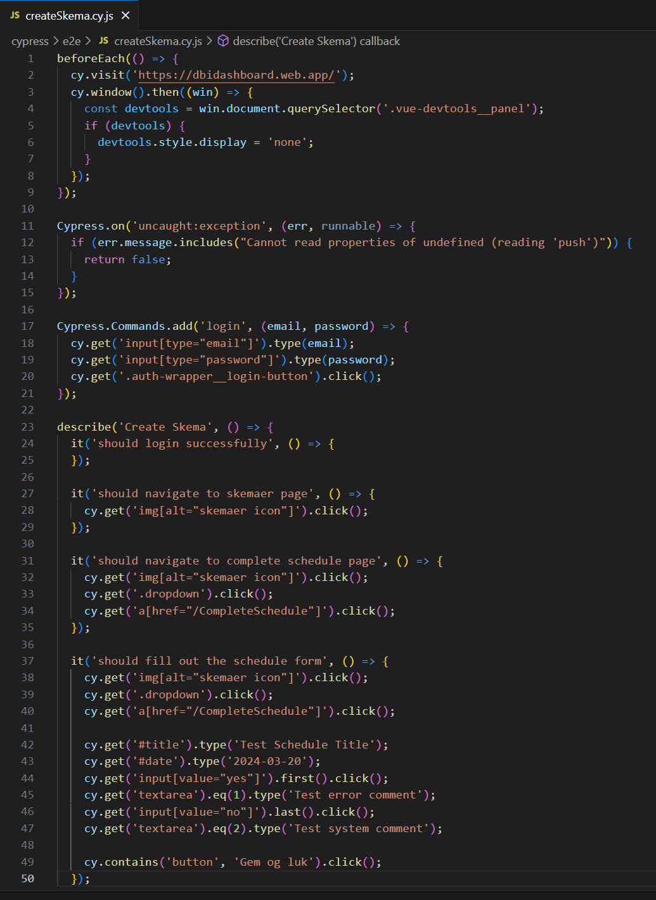
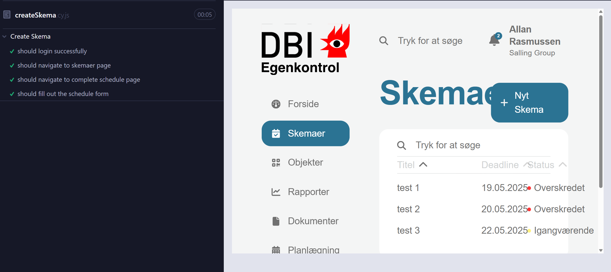
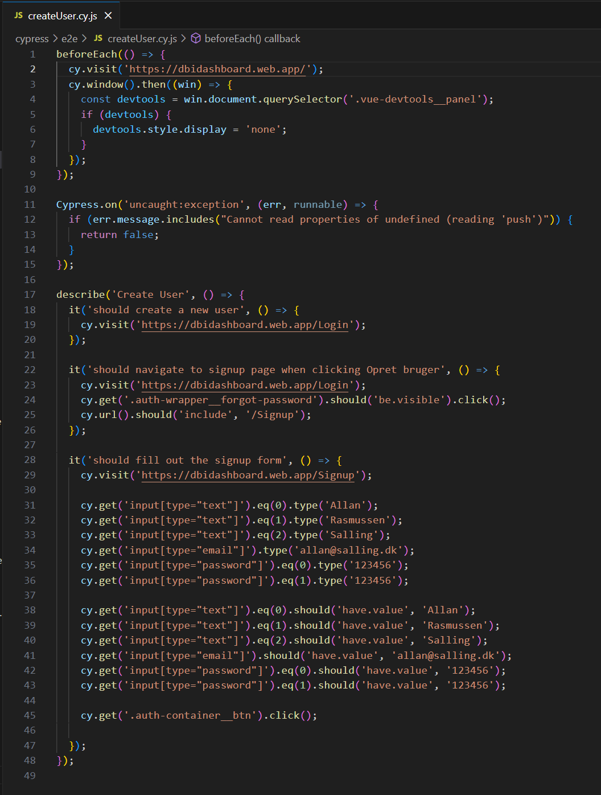
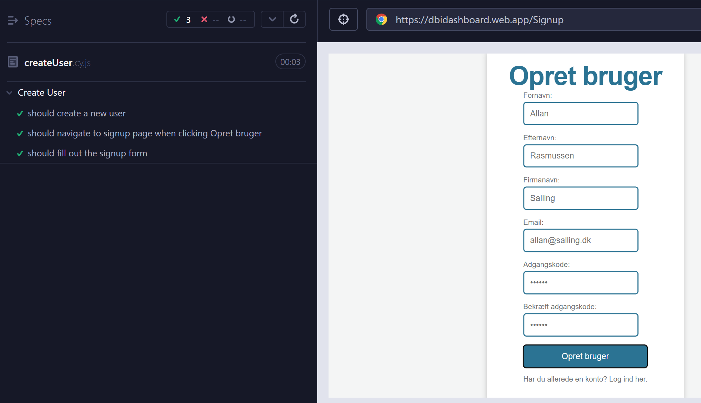

End-to-end testing anvendes til at tjekke et helt flow i ens applikation fra start til slut ud fra, hvordan brugeren kunne interagere på applikationen. Her testes om alt funktionalitet og navigationen på siden virker, som det skal.

Til at teste flowet anvendes Cypress. Til at lave en end-to-end test skal der laves en mappe, som hedder 'e2e' hvor ens test-filer ligger (udover de mapper, som Cypres selv opretter). Inde i denne e2e-mappe oprettes filer, hvori koden der testet på laves.

Til den ene udførte end-to-end test er flowet, at en bruger logger ind, laver et nyt skema og til sidst gemmer skemaet. Her er der oprettet filen createSkema.cy.js og her skrives koden til ens test.

Det der står ved beforeEach er det, der kører inden hver test.

Her kan den kode, der kører ses. Her kan det blandt andet ses, at den skal logge ind med brugernavn og email, og derefter gå ind på skema siden og derefter oprette et skema.

Her kan det ses, at testen kører, hvortil den til slut vil melde fejl, hvis der er fejl i ens flow, mens der vil komme flueben ud fra det hele, hvis flowet kører, som det skal.

-----------

I den anden test tester vi på, at der kan oprettes en bruger.

Her kan det ses, at den går ind på login siden, og derefter hen på opret bruger. Derefter opretter den en bruger med de værdier, der er givet. Derefter opretter den brugeren.

Derefter kan det ses, at den gennemfører flowet.

