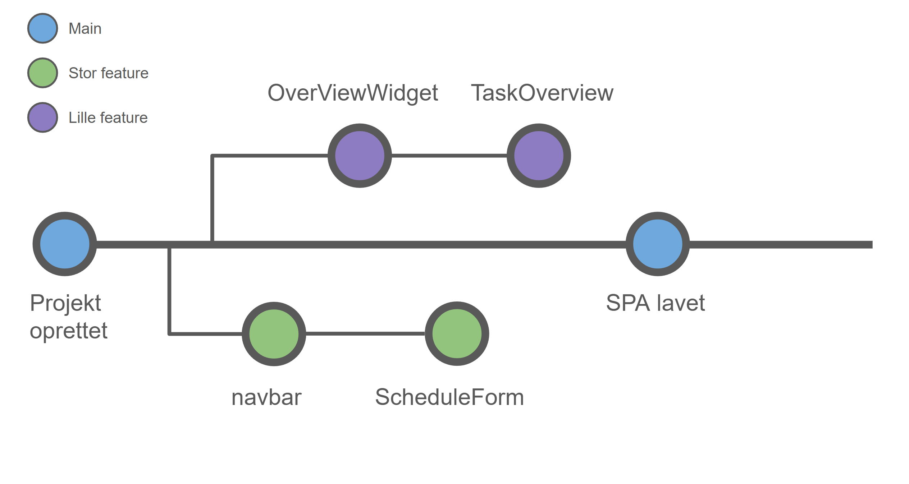

##GitHub og branching

Til versionsstyring af dette projekt er GitHub anvendt.

Platformen GitHub gør det muligt at arbejde flere omkring et projekt. Der oprettes et repository, hvori koden deles ved brug af commits og push-requests. Dermed er der en versionsstyring, hvori der hele tiden kan gås tilbage til tidligere versioner af koden.

Når der lægges ændringer op på GitHub, så skrives der også en beskrivelse af, hvad der ændret. Et eksempel på dette:

------------

------------

------------

Der er gjort brug af branches, ved brug af strategien feature branching. Der er lavet features og sider i de forskellige branches, og når disse er færdige, lægges de op på main-branch. 

Her er et eksempel på starten af vores branching, hvor der først er oprettet et projekt og derefter er lavet features:

-------------

## GitHub actions

Der er brugt GitHub actions til automatisk at bygge og deploye denne MkDocs side til GitHub Pages.
GitHub actions kører igennem en yaml-fil, som her er 'deploy-docs.yml'.

Det kan ses på linje 2-8, at dette workflow kører, når der enten pushes til main eller laves et pull request.
Derudover fortæller filen, at der opsættes og installeres python.

På linje 27-31 er der, hvor den deployer ændringerne til GitHub Pages, hvor den så finder det brugernavn og e-mail på den, der startede workflowet. Derefter pushes det til branchen gh-pages, som er den branch, der hører sammen med GitHub Page-siden.

Det kan ses her, at ændringerne lægges op på main, mens det også bliver builded og deployet til branchen, gh-pages:

---------------

---------------

Dermed kører denne GitHub action, når der pushes ændringer, hvortil det buildes og deployes op til GitHub Pages siden.