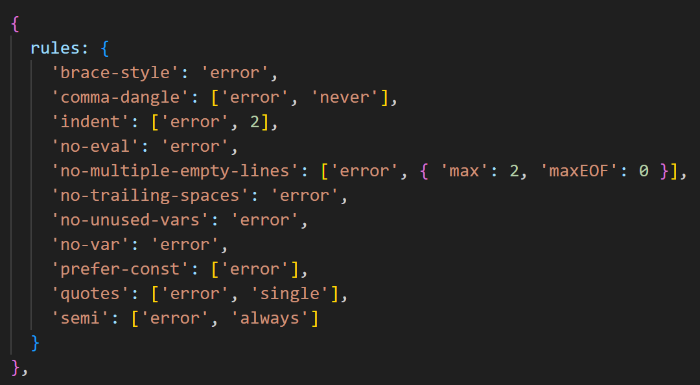
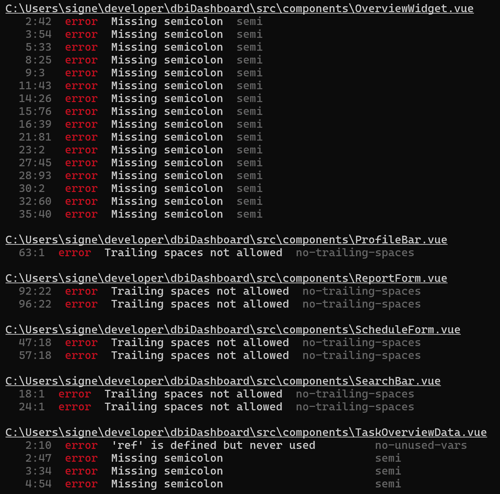
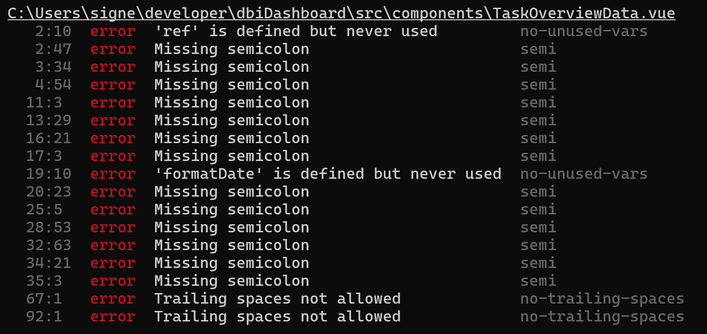
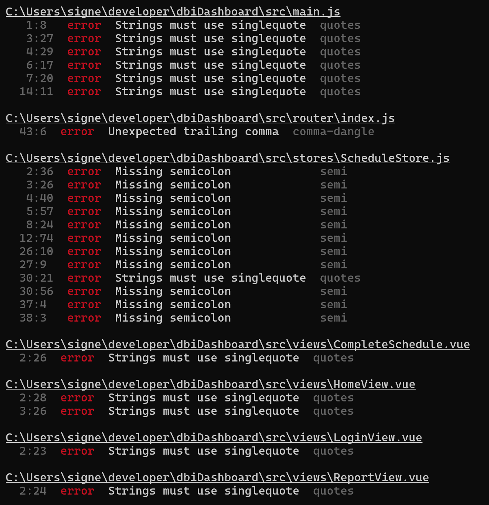

# Statisk kode analyse

## ESLint og refaktorering
Til at lave statisk kode analyse er der anvendt ESLint og linting regler.

Der er lavet reglerne:

- Den første curly-bracket skal stå på samme linje for koden, mens den sidste skal stå på egen linje.

- Ingen comma-dangle (ingen komma uden efterfølgende punkter).

- Der skal bruges 2 mellemrum til indrykning.

- Ingen brug af eval.

- Der må maks være to tomme linjer efter hinanden og ingen tomme linjer i slutningen af en fil.

- Ingen mellemrum efter semikolon.

- Ingen ubrugte variabler.

- Ingen brug af variabeltypen 'var'.

- Brug altid const, hvis variablen ikke ændrer sig.

- Altid bruge singlequotes.

- Altid bruge semikolon.

-------------

Linting regler er lavet for at holde en ensartet kodestruktur, og dermed hjælpe teamet med at holde den kodestandard, som er aftalt i teamet. Dermed kan man ved brug af ESLint finde de uoverenstemmerlser, der er med de regler, som er opsat og dermed udbedre dem.
Derfor kan der inden, der laves et commit til GitHub køres en ESLint, så det kode, der lægges op altid følger kodestandarden.

-------------

### Eksempel på ESLint fejl, som efterfølgende er blevet refaktoreret:

