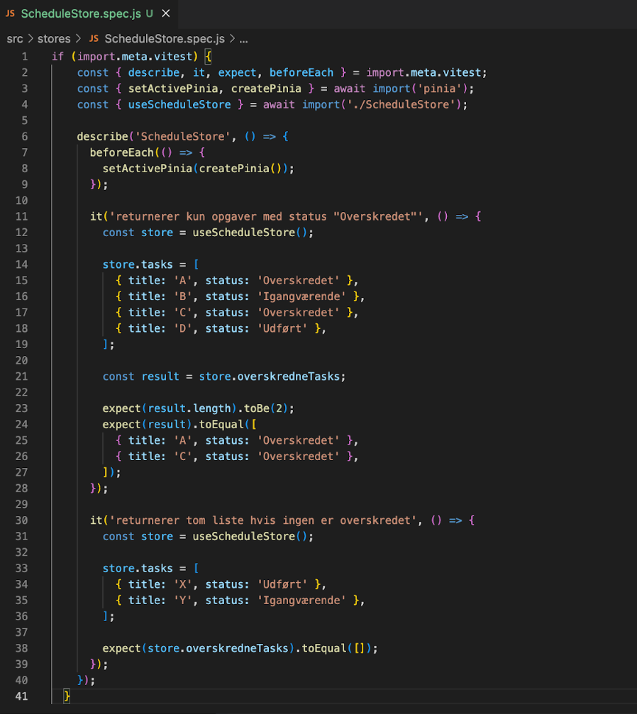
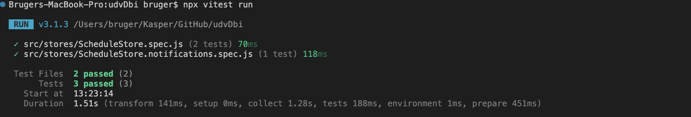
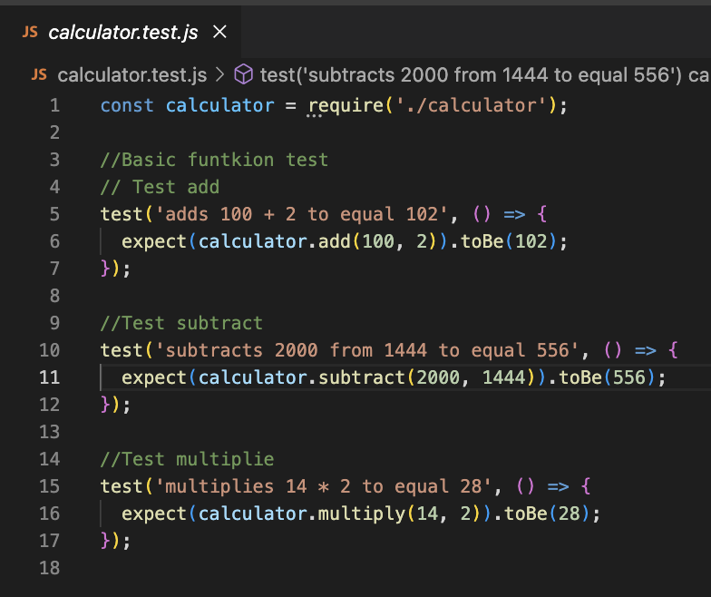

Ved brug af unit testing testes individuelle komponenter for sig selv. Her testet kun en funktion, hvortil det ses, om den gør, som den skal.

Til at lave unit tests laves der en fil til at teste i, som kaldes filnavnet.test.js. I disse filer bruges describe, som bruges til at lægge relaterede test sammen. Herinde i bruges it, som indeholder hver test for sig.

Derudover er der beforeEach, som er en funktion, der kører inden hver test, som er i describe-blokken.

Der er lavet fem unit test, hvor de første to er på DBI projektet, mens de sidste tre er på en lommeregner.

I den første og anden test bliver der testet på, om den filtrerer korrekt på statussen.

Her er der filen ScheduleStore.spec.js, som er test filen til ScheduleStore. I beforeEach fortælles, at der skal bruges state-manageren pinia til hver test.

I den første test tjekkes der for, at der kun returneres de skemaer, som har statussen 'overskredet'. Dette testes med mockdata. 

I test to testet det, at der skal returneres en tom liste, hvis der ikke er nogen overskredne overskredne skemaer.

Begge disse test er passed, kan der ses her:

I test tre, fire og frem testet der på en lommeregner:

Her testes det om lommeregneren kan plus, minus og gange.
